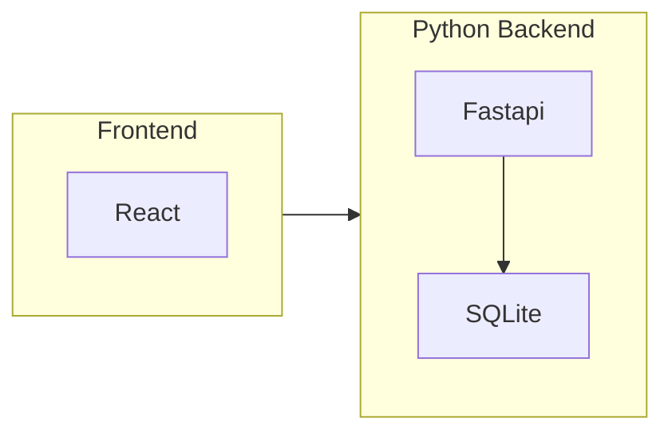

# Country Matchup

## Introduction

Country Matchup is a website that allows users to compare different countries across various metrics. This project uses Python with FastAPI for the backend and React with TypeScript for the frontend. The entire application is containerized using Docker.

## Features

- Interactive country data comparison tool
- User-friendly interface
- Enhanced data visualization with human-readable formatting using functions like Humanize.


## Technologies

- Backend: Python, FastAPI, SQLite
- Frontend: React, TypeScript, Tailwindcss
- Containerization: Docker
- Hosting: Google Cloud Run 

## Architecture


## Getting Started

These instructions will get you a copy of the project up and running on your local machine for development and testing purposes.

### Prerequisites

- Docker
- Docker Compose

### Installation

1. Clone the repository
2. Run docker-compose 
   ```bash
   docker compose up
    ```
